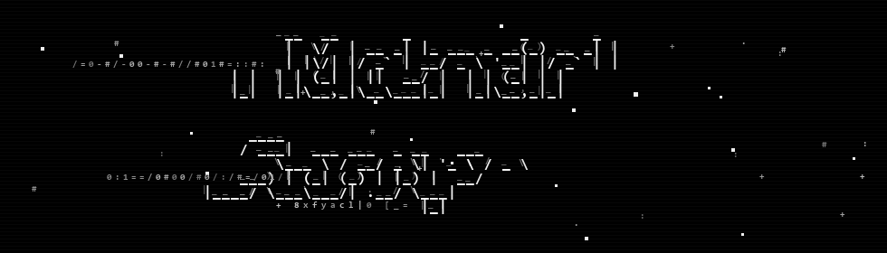

  <samp>utkuvibing/README.md</samp>
   
   
  <strong>Hey, I'm Utku.</strong>
   
   
  I build professional software for material science workflows.
   
  Currently building <strong>MaterialScope</strong>:
   
  an all-in-one characterization workspace for labs, teachers,
   
  master's &amp; PhD students, and scientists.
   
   
  
    material scientist / terminal wizard
     
    AI-assisted, engineer-filtered, lab-approved
  

---

  

  
  
  
  

