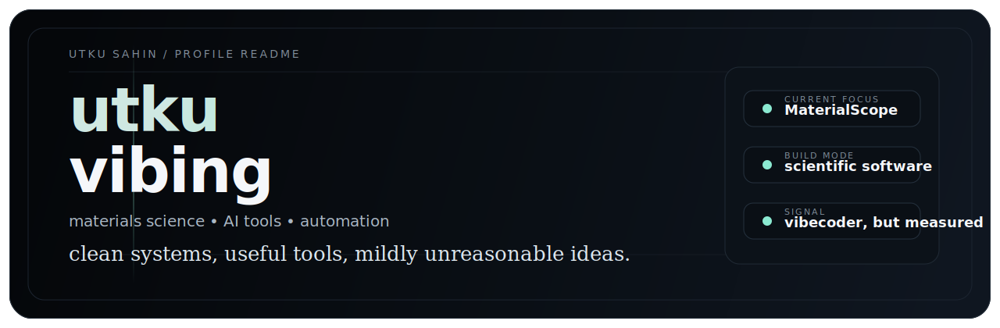

  

  <h1>utkuvibing</h1>
  
<strong>materials science × AI-assisted tools × automation</strong>

  

    I build scientific software, agentic workflows, and useful little machines for real-world problems.
  

  

    <em>I make atoms, APIs, and side projects work overtime.</em>
  

  
  
  
  

---

## About

- Materials science engineer / student building with a product mindset.
- Into AI-assisted tooling, scientific UX, automation, and software that saves people from repetitive work.
- Somewhere between technical founder energy, lab notebook logic, and tasteful late-night vibecoding.

## Selected Work

### MaterialScope

<strong>Flagship</strong> · materials intelligence workspace · currently shaping the direction

MaterialScope is the project I want this profile to orbit around: a cleaner interface for materials science workflows, analysis, and decision-making, built with the speed of modern AI tooling and the discipline of scientific software.

  
  
  
  

### [ThermoAnalyzer](https://github.com/utkuvibing/thermoanalyzer)

Scientific software · thermal analysis · Python

Vendor-independent thermal analysis suite for DSC, TGA, and DTA data with kinetics and peak deconvolution. This is the strongest public example of the science-software side of my work.

  
  
  

### [AMV Automation for After Effects](https://github.com/utkuvibing/amv_automation_after_effects)

Automation project · computer vision workflow · Python

AI-powered automation that places anime clips on After Effects timelines synced to beat markers using Gemini Vision. Slightly chaotic, very real, and a good snapshot of how I like to build automation.

  
  
  

## Stack

  
  
  
  
  
  
  

## Current Vibe

Building tools where science meets software, interfaces stay clean, and automation is allowed to be a little overqualified.

  Open to building at the intersection of materials, AI, and automation.

